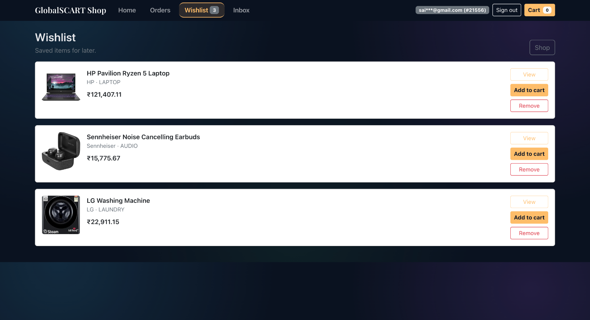
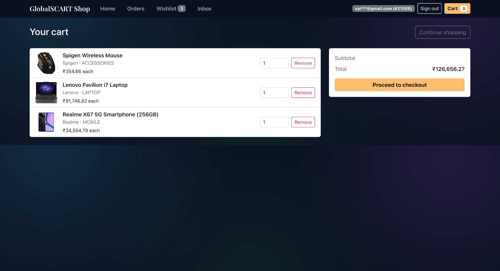
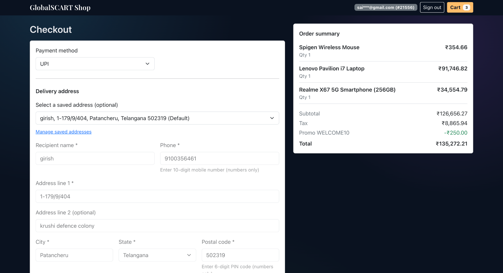
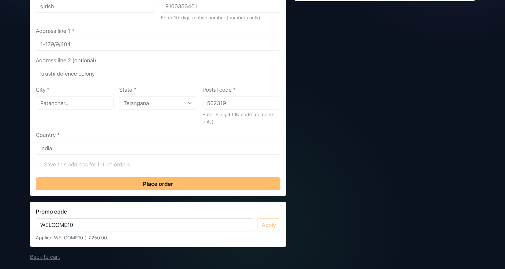
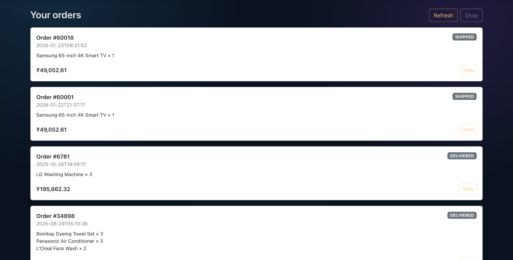
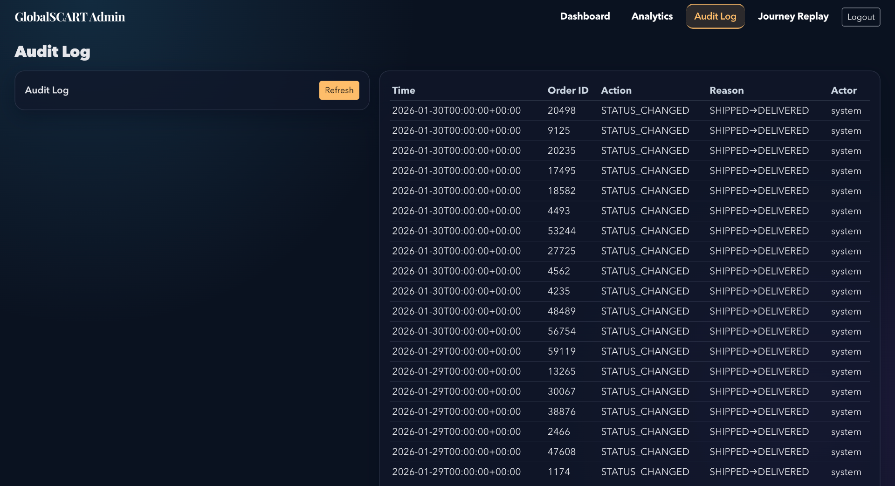

# GlobalCart 360: E-Commerce Analytics Platform + Transactional Store (Demo)

GlobalCart 360 is a **dual-purpose system**:
- **Analytics platform** for a global e-commerce business (single source of truth, near real-time KPIs, RFM/churn/cohorts, profit leakage, forecasting, BI marts)
- **Transactional demo storefront** with a **real order + payment lifecycle** (cart, checkout, atomic order creation, payment simulation, state transitions with rollback)

> This repo demonstrates both analytical and transactional patterns. The storefront is a demo, but the order/payment flow is implemented with real database transactions and explicit state machines.

## Project Summary (What reviewers should look at)
- **Transaction processing**: cart → checkout → payment lifecycle → order confirmation/cancellation
- **Analytics**: star schema + KPI views + incremental refresh + BI marts
- **Admin vs customer flows**: role-based access + protected admin endpoints
- **Evidence**:
  - API docs: `http://localhost:8000/docs`
  - API reference (repo): `docs/api.md`
  - UI flow (repo): `docs/ui.md`
  - Security notes (repo): `docs/security.md`
  - Transaction lifecycle code: `backend/routes/api_customer.py`
  - Lifecycle tests: `tests/test_checkout_lifecycle.py`
  - Storefront UI calling the lifecycle: `frontend/shop/checkout.html` + `frontend/shop/shop.js`

**Scope note:** this repository is not positioned as a full production e-commerce store (real payment provider integration, inventory reservation/stock deduction, fraud, PCI/compliance, etc.). Instead, it is a resume-ready **analytics + transactional demo** with a clear lifecycle and realistic architecture patterns.

For the “mixed concerns” story (analytics + APIs + UI + BI assets), see: `docs/architecture.md`.

## Demo Screenshots

### Customer Storefront

**Welcome / Landing**


**Sign Up (OTP-based)**


**Log In**


**Shop Home — Product Catalog & Filters**


**Wishlist**


**Cart**


**Checkout — Delivery & Payment**



**Order History**


**Inbox / Notifications**


### Admin Dashboard

**Admin Login**


**Analytics — Revenue, Funnel & Top Products**


**Audit Log — Order State Changes**


**User Journey Replay**


## Tech Stack
- SQL: PostgreSQL
- Python: FastAPI, pandas, numpy, seaborn/matplotlib, scikit-learn, statsmodels
- Frontend: HTML/CSS/JavaScript with Bootstrap, voice search
- Auth: OTP + JWT + role-based access
- Excel: KPI + pivot-based management report (generated/extracted from the same KPI definitions)
- Power BI / Tableau: dashboard specs + DAX measures (ready to implement in BI)

## Repository Structure
- `sql/`: star schema DDL, views, KPI queries, BI marts, cart/order/payment tables
- `src/`: data generator, loaders, extractors, analytics pipeline
- `backend/`: FastAPI server for admin/customer APIs and web UIs
  - `backend/routes/api_customer.py`: cart, checkout, order/payment lifecycle
  - `backend/routes/api_auth.py`: OTP + JWT auth, `/me` endpoint
  - `backend/routes/api_admin.py`: admin APIs (JWT or admin-key auth)
  - `backend/routes/api_payments.py`: Razorpay sandbox (order + confirm + webhook)
- `frontend/`: customer storefront (/shop) and admin UI assets
- `notebooks/`: EDA, RFM segmentation, forecasting (notebook-friendly)
- `docs/`: data dictionary, KPI definitions, architecture
- `dashboards/`: Power BI/Tableau specs + DAX measures
- `data/`: generated raw and processed extracts (created at runtime)

## Transactional E-commerce Features (Implemented)

### Cart
- Persistent cart per customer (`customer_cart_items` table)
- APIs: `GET/POST/PUT/DELETE /api/customer/cart`
- Auth: Send `Authorization: Bearer <JWT>` (recommended). Query `customer_id` is supported only as a fallback.

### Checkout & Order Lifecycle
- **Atomic order creation**: `POST /api/customer/checkout/start`
  - Creates `ORDER_CREATED` + `PAYMENT_PENDING` in one DB transaction
  - Returns `order_id` and `payment_id`
- **Payment completion (simulated)**: `POST /api/customer/orders/{order_id}/simulate-payment`
  - Body: `{ "success": true }` or `{ "success": false, "failure_reason": "BANK_DOWN" }`
  - Success: `ORDER_CONFIRMED` + `PAYMENT_SUCCESS` + creates shipment
  - Failure: `ORDER_CANCELLED` + `PAYMENT_FAILED` + records cancellation reason
- **State machine**: `ORDER_CREATED → PAYMENT_PENDING → {PAYMENT_SUCCESS → ORDER_CONFIRMED} | {PAYMENT_FAILED → ORDER_CANCELLED}`
- **Rollback**: All operations use DB transactions; any error rolls back without partial writes

### Implemented vs planned

Implemented in this repo:
- Product catalog browsing + search/filter
- Persistent cart
- Checkout start (atomic order + payment pending)
- Inventory enforcement (stock reservation at checkout to prevent oversell)
- Payment flows:
  - Simulated payment callback for deterministic demos
  - Razorpay sandbox order/confirm/webhook
- Admin APIs (JWT or admin key) + analytics endpoints

Planned / out of scope for this demo:
- Advanced inventory (multi-warehouse, reservations expiry, backorders)
- Refunds workflow + reconciliation
- Refresh tokens + session rotation
- Production payment provider hardening (fraud, PCI scope, etc.)

## Known Limitations (Prototype / Demo scope)

- **Inventory locking**
  - Implemented as a **single-database reservation model** (row locks + `reserved_qty`) to prevent basic oversell.
  - Not implemented: multi-warehouse allocation, reservation expiry, backorders, stock reconciliation jobs.

- **Payment webhook idempotency**
  - Implemented for Razorpay webhooks via an idempotency table (`globalcart.payment_webhook_events`) keyed by `(provider, event_id)`.
  - Not implemented: provider-side idempotency keys for all payment creation calls, event replay tooling, and a full reconciliation job.

- **Payment failure recovery / reconciliation**
  - The demo models `PENDING/SUCCESS/FAILED` states and logs webhook events.
  - Not implemented: automated reconciliation for "money captured but DB update failed" scenarios (would be a periodic job in production).

- **Role management / audit trail**
  - Admin role assignment is treated as **manual** for this prototype.
  - Not implemented: role change audit fields (`role_updated_at`, `role_updated_by`) and an admin audit log workflow.

- **Rate limiting**
  - A basic in-memory rate limiter exists in `backend/main.py` for `/api/*`.
  - Not implemented: distributed rate limiting (Redis) and WAF/bot protection as would be expected in production.

- **Tests scope**
  - Tests validate lifecycle correctness, rollback, inventory reservation/consume/release, and endpoint behavior.
  - Not implemented: adversarial/concurrency testing (highly concurrent checkouts), fuzzing, and full security test coverage.

- **API contracts**
  - Most endpoints use Pydantic models; some legacy paths and query-parameter fallbacks remain for backwards compatibility.

### Auth & Access
- OTP-based signup/login (`/api/auth/request-otp`, `/api/auth/verify-otp`)
- JWT tokens (`/api/auth/token`) with role-based access (`customer`/`admin`)
- Admin endpoints accept either JWT (role=admin) or X-Admin-Key header

### Where the Code Lives
- Cart: `backend/routes/api_customer.py` (`/cart` endpoints)
- Checkout & payment lifecycle: `backend/routes/api_customer.py` (`/checkout/start`, `/orders/{id}/simulate-payment`)
- Auth: `backend/routes/api_auth.py` and `backend/security.py`
- Models: `backend/models.py` (`CheckoutStartOut`, `PaymentSimulateIn/Out`, `CartSummaryOut`)
- DB schema: `sql/10_shop_features.sql` (cart table), `sql/00_schema.sql` (orders/payments)

## API Documentation (Orders + Payments)

FastAPI publishes interactive docs via OpenAPI/Swagger:
- Local: `http://localhost:8000/docs`

### Auth (JWT)

1) Get a JWT token:
```bash
curl -X POST http://localhost:8000/api/auth/token \
  -H "Content-Type: application/json" \
  -d '{"email":"you@example.com","password":"YourPassword"}'
```

2) Use it in subsequent calls:
```bash
Authorization: Bearer <access_token>
```

### Create an order (initiate payment)

Endpoint:
- `POST /api/customer/checkout/start`

Creates:
- `fact_orders.order_status = ORDER_CREATED`
- `fact_payments.payment_status = PAYMENT_PENDING`

Example:
```bash
curl -X POST http://localhost:8000/api/customer/checkout/start \
  -H "Content-Type: application/json" \
  -H "Authorization: Bearer <token>" \
  -d '{
    "items": [{"product_id": 1001, "qty": 2}],
    "channel": "WEB",
    "currency": "INR",
    "payment_method": "UPI"
  }'
```

### Complete payment (success / failed)

Endpoint:
- `POST /api/customer/orders/{order_id}/simulate-payment`

Success transition:
- `PAYMENT_PENDING → PAYMENT_SUCCESS`
- `ORDER_CREATED → ORDER_CONFIRMED`

Failure transition:
- `PAYMENT_PENDING → PAYMENT_FAILED`
- `ORDER_CREATED → ORDER_CANCELLED`

Examples:

Success:
```bash
curl -X POST http://localhost:8000/api/customer/orders/12345/simulate-payment \
  -H "Content-Type: application/json" \
  -H "Authorization: Bearer <token>" \
  -d '{"success": true}'
```

Failure:
```bash
curl -X POST http://localhost:8000/api/customer/orders/12345/simulate-payment \
  -H "Content-Type: application/json" \
  -H "Authorization: Bearer <token>" \
  -d '{"success": false, "failure_reason": "BANK_DOWN"}'
```

### Webhooks
This project includes both:
- a **simulated payment** endpoint for deterministic demos (`/api/customer/orders/{order_id}/simulate-payment`)
- a **Razorpay sandbox** integration with provider-signed webhooks.

Razorpay endpoints:
- `POST /api/payments/razorpay/order?order_id=...` (creates Razorpay Order for an existing GlobalCart `order_id`)
- `POST /api/payments/razorpay/confirm` (verifies checkout signature and confirms the order)
- `POST /api/payments/razorpay/webhook` (provider-signed event ingestion + idempotency)

## Step-by-step (Local + Public URL)

### 0) Prerequisites
- Python 3
- Docker + Docker Compose
- `cloudflared` installed (for public URL)

### 1) Start PostgreSQL (Docker)
From the repo root:

```bash
docker compose up -d
```

### 2) Create venv + install Python deps
From the `globalcart-360` folder:

```bash
python -m venv .venv
source .venv/bin/activate
pip install -r requirements.txt
```

### 3) Generate synthetic (realistic) data

```bash
python -m src.generate_data --scale small
```

### 4) Load into PostgreSQL + build views

```bash
python -m src.load_to_postgres
python -m src.run_sql --sql sql/02_views.sql
```

### 5) Enable auth + cart tables
```bash
python3 -m src.run_sql --sql sql/07_app_auth.sql
python3 -m src.run_sql --sql sql/10_shop_features.sql
python3 -m src.run_sql --sql sql/11_razorpay.sql
python3 -m src.run_sql --sql sql/12_inventory.sql
```

### 6) Start the FastAPI backend (serves Shop + Admin)

```bash
python3 -m uvicorn backend.main:app --host 0.0.0.0 --port 8000 --reload
```

### 7) Open the local URLs
- Shop: http://localhost:8000/shop/
- Admin: http://localhost:8000/admin/
- API docs: http://localhost:8000/docs

### 8) Admin login
- Default Admin Username: `admin`
- Default Admin Password: `admin`

### 9) Make it public (Cloudflare Quick Tunnel)
Optional (demo convenience): in a new terminal (keep backend still running):

```bash
cloudflared tunnel --url http://127.0.0.1:8000
```

### 10) Open the public URLs
Use the `trycloudflare.com` URL printed by `cloudflared`, then open:
- Shop: `<public-url>/shop/`
- Admin: `<public-url>/admin/`
- API docs: `<public-url>/docs`

Note: Quick Tunnel URLs are **ephemeral** and change on restart.

### 11) Want the same URL always?
Use a custom domain + Cloudflare **named tunnel** (stable URL).

## CI/CD and Deployment

- CI: GitHub Actions workflow at `.github/workflows/ci.yml` runs `pytest` and boots a Postgres service.
- Container: `Dockerfile` can be used for Railway/Render/Fly.io.
- Deployment guide: `docs/deployment.md`

### Troubleshooting
- If UI pages are not loading, confirm the backend is running on `http://127.0.0.1:8000`.
- If the public URL stops working, restart the quick tunnel command and use the new printed `trycloudflare.com` URL.
- If cart/checkout APIs return 500, ensure you ran the SQL in step 5.

## One-command pipeline
After PostgreSQL is running:
```bash
python -m src.pipeline --scale small --truncate
```

## Near real-time incremental refresh (simulation)
This simulates a production-style incremental load with:
- new orders/payments/shipments
- late-arriving returns/refunds
- status updates (delivered → delayed, delivered → completed)
- `updated_at` watermark and idempotent upserts

### 1) Ensure incremental objects exist (staging + upsert functions)
```bash
python -m src.run_sql --sql sql/04_incremental_refresh.sql --stop-on-error
```

### 2) Snapshot KPIs (before)
Run in psql / any SQL client:
```sql
SELECT globalcart.snapshot_kpis('before');
```

### 3) Run incremental refresh
```bash
python -m src.incremental_refresh --since_timestamp "2025-12-19T12:00:00"
```

### 4) Snapshot KPIs (after) and compare
```sql
SELECT globalcart.snapshot_kpis('after');
\i sql/05_before_after_kpis.sql
```

## Power BI Integration (BI Marts)
### 1) Create BI materialized marts for Power BI
```bash
python -m src.run_sql --sql sql/06_bi_marts.sql
```

### 2) Refresh BI marts after new data
```sql
SELECT globalcart.refresh_bi_marts();
```

### 3) Power BI connection
- Use PostgreSQL connector with `PGHOST`, `PGPORT`, `PGDATABASE`, `PGUSER`, `PGPASSWORD` from `.env`
- Import tables: `mart_exec_daily_kpis`, `mart_finance_profitability`, `mart_funnel_conversion`, `mart_product_performance`, `mart_customer_segments`
- See `dashboards/powerbi/powerbi_bi_integration.md` for detailed setup and DAX measures.

## KPI Consistency
KPI definitions are centralized in:
- `docs/kpi_definitions.md`
- SQL views in `sql/02_views.sql`

Dashboards and Python reuse the same definitions.

## Notes
- Default `--scale small` generates a sample sized dataset for laptops.
- The schema and scripts are designed to scale conceptually to 100M+ orders/year with incremental/streaming ingestion patterns documented in `docs/architecture.md`.
- Transactional features (cart, checkout, payments) are implemented with real DB transactions and explicit state machines suitable for interview demonstration.
